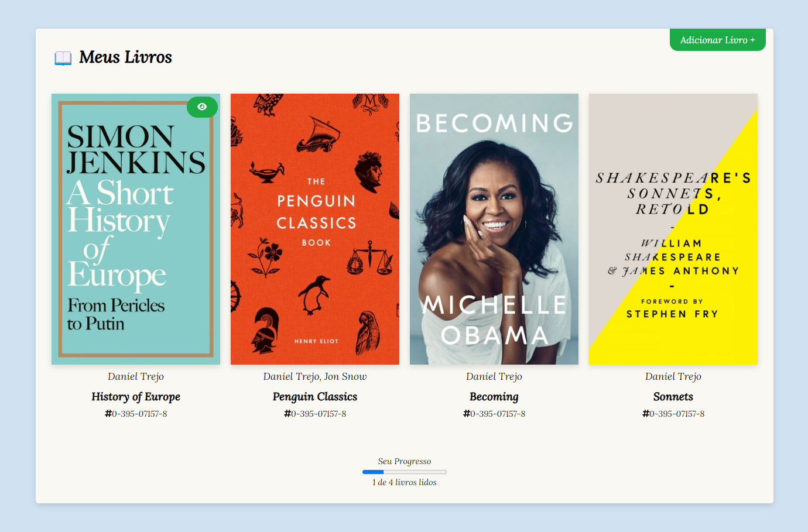

<h1 align="center">Book List</h1>

  

## 🚀 Tecnologias

Esse projeto foi desenvolvido com as seguintes tecnologias:

- HTML
- CSS
- JavaScript
- VueJS

## 💻 Projeto

Este app de book list é um projeto simples feito para estudar Composition API no VueJS. Pode se adicionar novos livros a serem lidos, marcar livros adicionados como lidos e ver o progresso de leitura de todos os livros adicionados na inferior de status.

---

Feito com ♥ by Cleber Risu
